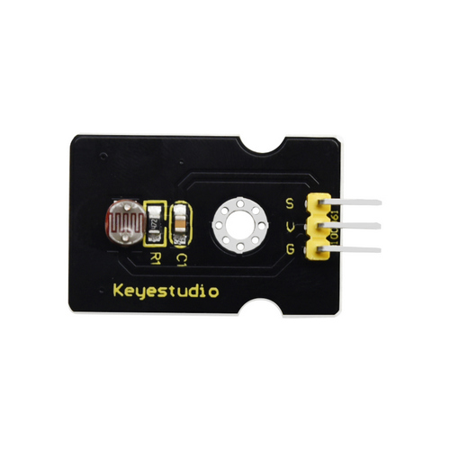
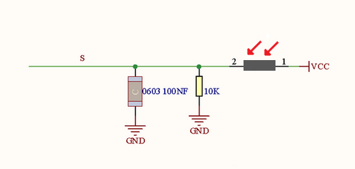
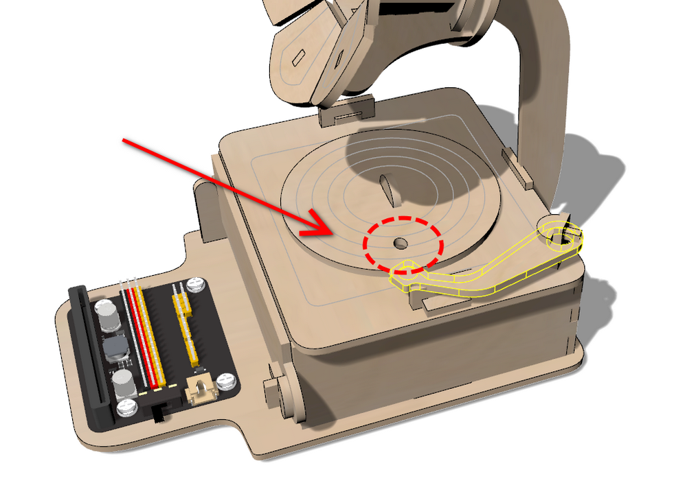
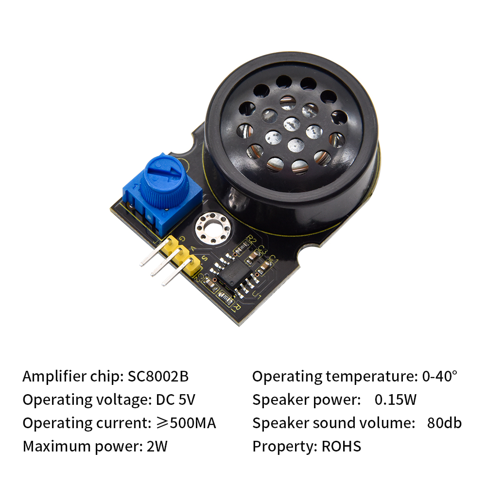

# ESP32 Easy Coding Board Phonograph Projects

## 1. Projects

1. Photoresistor: Light Detector

Photoresistor

Photoresistor, also known as photoelectric sensor, is a sensor that converts optical signals into electrical ones (voltage, current, resistance, etc.) through photoelectric devices. In the circuit, there is a resistor whose resistance value depends on light intensity.

The photoresistor enters the circuit in series, and we add an appropriate voltage. When there is no light, the resistance is infinity, so the circuit is close to open. When there is light, its resistance reduces and the current increases. If the light is bright enough, it is equivalent to a short circuit.

Herein, we write code on the ESP32 Easy Coding Board to read the value of the photoresistor.

Principle Diagram

Light hits the photoresistor. The harder the light is, the smaller the resistance value will be, and the greater the voltage (VCC passing through the resistor) will be.

------

Wiring Diagram

------

Parameters

- Voltage: 3~5V

- Current: 0.2mA
- Power: 1mW
- Spectral peak: 540nm
- Bright resistance (10lux): 5~10KR
- Dark resistance: 0.5MR

------
Test Code 1

- Initialize the serial port.

  

- Read the analog value of pin 14.

  

- Complete code

  

------

Test Result 1

A hole is reserved on the phonograph and the photoresistor is under it, as shown below:

------

Move the tone arm above the hole, and open the serial monitor to set baud rate to 115200.

And the monitor prints:

------

If we move the tone arm away, 

the serial monitor will print analog values of the photoresistor.

------

Test Code 2

If no light is detected, light up RGB dot matrix; when there is light, turn off RGB dot matrix.

- Initialize the serial port and RGB dot matrix.

  

- Define a variable to store the detected light values.

  

  

  

- Assign the detected light value to the variable and print it.

  

- Determine whether the value is greater than 10. If yes, turn off RGB dot matrix. If not, light up RGB dot matrix.

  

- Complete code

  

Test Result 2

  Put the tone arm above the hole position, and the RGB dot matrix will light up.

Remove the arm and RGB dot matrix will turn off.

------

2. Power Amplifier: Music Box

Power Amplifier

The power amplifier mainly consists of a potentiometer, a speaker, and an audio amplifier chip. This module amplifies the small audio signals about 8.5 times, and plays audio through its built-in speaker. Therefore, it can be used to play music or as an external amplifier for some music players.

Principle Diagram

------

Wiring Diagram

------

Test Code 1

- Find **Music** Block.

  

- Set pin to IO4.

  

- Set frequency.

  

-  Complete code: 7 basic tones

  

Test Result 1

The amplifier will play the 7 basic tones. 

Rotate the potentiometer on the module to adjust the volume.

Test Code 2

------

Test Result 2

The module plays the set music.

------

3. Light Control Phonograph

Introduction

In this project, we try to simulate a real phonograph: when the tone arm is placed on the turntable, it plays music; When we remove it, it finishes the current music and then stops singing.

Test Code

- Initialize RGB dot matrix.

  

- Define a variable to store the detected light value.

  

  

  

- Assign the detected light value to the variable.

  

- Determine whether the value is greater than 10. If yes, turn off the RGB dot matrix and the music. If not, turn on the RGB dot matrix and play music.

  

- Complete code

  

Test Result

Put the tone arm above the hole position, and it starts to play music with RBG lighting up. Remove the arm, and the music and RGB dot matrix both turn off.

------

4. Button Control Phonograph

In this project, we control the phonograph with buttons. 

There are two button (A and B) on the board. Herein, we utilize these buttons to have a switchover of songs: press A for the previous song with a left arrow showing on the dot matrix; press B for the next song with a right arrow showing on the dot matrix.

------

Test Code

- Initialize the RGB dot matrix.

  

- Define a button-control block **“f_button”** to represent the codes of button.

  

  

- Show “<” when A is pressed; show “>” when B is pressed.

  

- Define two variables **”button_value”** and **”play“**.

  

  

- We have enrolled four song numbered as 0, 1, 2 and 3. Variable **”button_value”** stores the song number.

  1. To ensure button_value is within 0~3, we set button_value to 0 when it is less than 1, and set it to 3 when it is greater than 2. 

  2. When we press button A/B, we set **“play”** to 1 to play music.

  Press button A and button_value-1

  

  Press button B and button_value+1

  

  Complete button-control code:

  

- Read the value of **”button_value”** to determine which song should be played. After the song is finished, set play to 0 to have a pause.

  

-  Complete code

   

Test Result

Music is being played:

Pause:

The next song:

The previous song:

------

## 2. FAQ

Q: Battery model?

A: Four AAA batteries. Please install the batteries in the correct direction rather than reverse them! For younger students, please be accompanied by your parents!

------

Q: Errors occur when ESP32 burns code?

A: 

- Please check whether the USB port number is correct.
- Please ensure the main board model is available. 

------

Q: Expand to external modules?

A: It can expand to external modules. For details, please follow the ESP32 pin instructions to ensure external modules can normally work.

------

## 3. Resources

Keyestudio official:

[https://www.keyestudio.com/](https://www.keyestudio.com/)

Keyestudio wiki:

[https://wiki.keyestudio.com/Main_Page](https://www.keyestudio.com/)

Arduino official:

[https://www.arduino.cc/](https://www.keyestudio.com/)

ESP32 espressif official:

[https://www.espressif.com/](https://www.keyestudio.com/)
