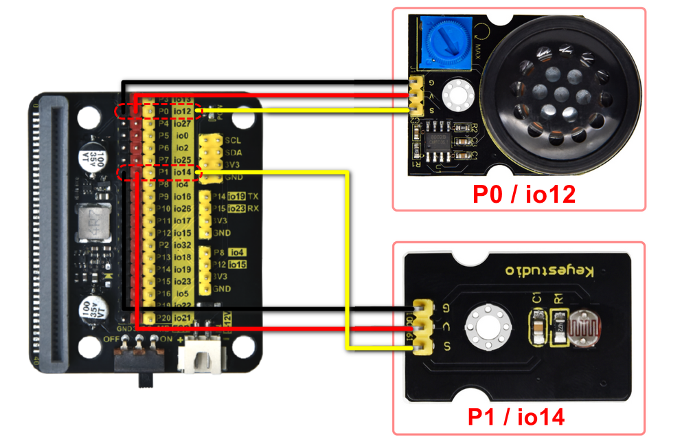

# Micro:bit Phonograph Projects

## 1. Projects

### 1. Photoresistor: Light Detector

#### Photoresistor

Photoresistor, also known as photoelectric sensor, is a sensor that converts optical signals into electrical ones (voltage, current, resistance, etc.) through photoelectric devices. In the circuit, there is a resistor whose resistance value depends on light intensity.

The photoresistor enters the circuit in series, and we add an appropriate voltage. When there is no light, the resistance is infinity, so the circuit is close to open. When there is light, its resistance reduces and the current increases. If the light is bright enough, it is equivalent to a short circuit.

Herein, we write code on the Microbit to read the value of the photoresistor.

#### Principle Diagram

Light hits the photoresistor. The harder the light is, the smaller the resistance value will be, and the greater the voltage (VCC passing through the resistor) will be.

------

#### Wiring Diagram

------

#### Parameters

- Voltage: 3~5V

- Current: 0.2mA
- Power: 1mW
- Spectral peak: 540nm
- Bright resistance (10lux): 5~10KR
- Dark resistance: 0.5MR

------
#### Test Code 1

- Initialize the serial port.

  

  

- Read the analog value of pin.

  

- Set pin to P1

  

- Complete code

  

------

#### Test Result 1

A hole is reserved on the phonograph and the photoresistor is under it, as shown below:

------

Move the tone arm above the hole, and open the CoolTerm serial monitor to set baud rate.

Set the COM port (the port number varies from devices).

------

If we move the tone arm away, 

the serial monitor will print analog values of the photoresistor.

------

#### Test Code 2

If no light is detected, light up RGB dot matrix; when there is light, turn off RGB dot matrix.

- Define a variable to store the detected light values.

- Assign the detected light value to the variable and print it.

  

- Create a logic code.

  

  

- Determine whether the value is lower than or equals 10.

  

  

- Complete code

  

------

#### Test Result 2

- Put the tone arm above the hole position, and the RGB dot matrix will light up.

  

- Remove the arm and RGB dot matrix will turn off.

  
  
  Put the tone arm on the turntable of the phonograph, it covers the hole so the photoresistor detects no light. Remove the arm, and light hits the photosensor. We can know whether the phonograph plays music by checking whether the photosensor detects light. Pay attention that if you put the phonograph in a completely dark environment, it will play music because the photoresistor cannot detect light.

------

### 2. Power Amplifier: Music Box

#### Power Amplifier

The power amplifier mainly consists of a potentiometer, a speaker, and an audio amplifier chip. This module amplifies the small audio signals about 8.5 times, and plays audio through its built-in speaker. Therefore, it can be used to play music or as an external amplifier for some music players.

#### Principle Diagram

------

#### Wiring Diagram

------

#### Test Code 1

- Find **music**

  

- Set melody.

  

- Complete code

  

#### Test Result 1

The amplifier will play the 8 basic tones. 

Rotate the potentiometer on the module to adjust the volume.

**ATTENTION: The louder the volume is, the more the current will be consumed, so it may suffer from a power shortage. Thereby, the Microbit hard disk will fail to appear on PC due to its disabled USB port, so then codes are unable to be uploaded. Solution: When uploading code, adjust the volume to its minimum.**

#### Test Code 2

Find a play block in music.

#### Test Result 2

The module plays the set music.

------

### 3. Light Control Phonograph

#### Introduction

In this project, we try to simulate a real phonograph: when the tone arm is placed on the turntable, it plays music; When we remove it, it finishes the current music and then stops singing.

#### Test Code

- Define a variable to store the detected light value.

  

  

- Assign the detected light value to the variable and print it.

  

- Create a logic code.

  

- Determine whether the value is less than or equals 10.

  

- If the value is greater than 10, turn off the RGB dot matrix and the music. If it is less than 10, turn on the RGB dot matrix and play music.

  

  **ATTENTION: The louder the volume is, the more the current will be consumed, so it may suffer from a power shortage. Thereby, the Microbit hard disk will fail to appear on PC due to its disabled USB port, so then codes are unable to be uploaded. Solution: When uploading code, adjust the volume to its minimum.**

#### Test Result

Put the tone arm above the hole position, and it starts to play music with RBG lighting up. Remove the arm, and the music and RGB dot matrix both turn off.

------

### 4. Button Control Phonograph

There are two button (A and B) on the board. Herein, we utilize these buttons to have a switchover of songs: press A for the previous song with a left arrow showing on the dot matrix; press B for the next song with a right arrow showing on the dot matrix.

#### Test Code

- Add a button input block.

  

- Show “<” when A is pressed; show “>” when B is pressed.

  

- Define two variables **”button_value”** and **”play“**.

  

  

  

- We have enrolled four song numbered as 0, 1, 2 and 3. Variable **”button_value”** stores the song number.

  1. To ensure button_value is within 0~3, we set button_value to 0 when it is less than 1, and set it to 3 when it is greater than 2. 

  2. When we press button A/B, we set **“play”** to 1 to play music.

- Press button A and button_value-1

  

- Press button B and button_value+1

  

  

- Read the value of **”button_value”** to determine which song to play. After finishing a song, set **play** to 0 to pause.

  

-  Complete code

  

   **ATTENTION: The louder the volume is, the more the current will be consumed, so it may suffer from a power shortage. Thereby, the Microbit hard disk will fail to appear on PC due to its disabled USB port, so then codes are unable to be uploaded. Solution: When uploading code, adjust the volume to its minimum.**

#### Test Result

-  Music is being played:

  

-  Pause:

  

-  The next song:

  

-  The previous song:

  

------

## 2. Troubleshooting

### 2.1  Code fails to download to Micro:bit

#### Problem

Recently, many users encounter the issue that Micro:bit board doesn’t respond when download code.

If the way you operate is correct, maybe you accidentally press the reset button and enter the Maintenance mode or the firmware is lost due to mis-operation.

Plug in Micro:bit board, the “MAINTENANCE” drive appears, which means the program can’t be downloaded.

#### Solution

1. Download the **hex file** from this page to your computer.

	Down load the latest micro:bit firmware-0255: https://www.microbit.org/get-started/user-guide/firmware/ 
	If you do not want to download from this website, we also provide it in our tutorial.

2. After the latest firmware is downloaded, then drag it into the “MAINTENANCE” to make Micro:bit back to normal mode.

#### Avoid to Enter “MAINTENANCE”

1. Make sure the Reset button is **not** pressed when plugging the board by USB cable.

      
      
2. Don't unplug the cable suddenly during downloading micro:bit program, otherwise, the firmware will be lost and micro:bit will enter “MAINTENANCE” mode.
3. In the experiment, wrong wiring also cause a short circuit or firmware lost.

------

### 2.2 Troubleshooting-Download with WebUSB

Having trouble pairing the Micro: bit with WebUSB (/ device/usb/webusb)?

#### Step 1: Check cable

Make sure that your micro:bit is connected to your computer with a micro USB cable. You should see a **MICROBIT** drive appear in Windows Explorer when it’s connected.

**If you can see the MICROBIT, please go to step 2**.

If you can’t:

- Make sure that the USB cable is working. Does the cable works on another computer? If not, find a different cable to use. Some cables may only provide a power connection and don’t actually transfer data.
- Try another USB port on your computer. 
- Is the cable good but you still can’t see the **MICROBIT** drive? Hmm, you might have a problem with your micro:bit. 
- Try the additional steps described in the [falut finding](https://support.microbit.org/support/solutions/articles/19000024000-fault-finding-with-a-micro-bit) at microbit.org.
- If this doesn’t help, you can create a [support ticket](https://support.microbit.org/support/tickets/new) to notify the Micro:bit Foundation of the problem. If you do so, **skip the rest of these steps**.

#### Step 2: Check firmware version

It’s possible that the firmware version on the micro:bit needs an update. Let’s check:

1. Go to the **MICROBIT** drive.
2. Open the **DETAILS.TXT** file.

3. Look for the version number. It should say **Version: ...**

	

	Or **Interface Version: ...**

	

	If the version is **0234**, **0241**, **0243**, you need to update the [firmware](https://makecode.microbit.org/device/firmware) on your micro:bit. Go to **Step 3** and follow the upgrade instructions.

	If the version is **0249**, **0250** or higher, you have the right firmware, just go to **step 4**.

#### Step 3: Update firmware

1. Put your micro:bit into **MAINTENANCE Mode**. 

	To do this, please unplug the USB cable from the micro:bit and then re-connect the USB cable after pressing and holding the reset button. Once you insert the cable, you can release the reset button. You should now see **MAINTENANCE** instead of the **MICROBIT** drive. Also, a yellow LED indicator will stay on. 

2. Download firmware .hex file: <https://microbit.org/guide/firmware/>
3. Drag the file into the **MAINTENANCE** drive.
4. The yellow LED will flash while the HEX file is copying. After that, the LED will go off and the micro:bit resets. The **MAINTENANCE** drive now changes to **MICROBIT**.
5. The upgrade is complete! You can open the **DETAILS.TXT** file to check the firmware version that matches the one of the **HEX** file you copied.

If you want to know more about connecting the board, MAINTENANCE Mode, and upgrading the firmware, please refer to [Firmware guide](https://microbit.org/guide/firmware/).

#### Step 4: Check version of Browser

WebUSB may require you to update your browser. 

Check that your browser version matches one of these: **Android**, **Chrome OS**, **Linux**, **macOS** and **Windows 10 Chrome 65+**.

#### Step 5: Pair device

Once you’ve updated the firmware, open the **Chrome Browser**, go to the editor and click on **Pair Device** in settings. 

See [WebUSB](https://microbit.org/get-started/user-guide/web-usb/) (/ device / usb / webusb) for pairing instructions.

------

## 3. Resource

Keyestudio Official:

[https://www.keyestudio.com/](https://www.keyestudio.com/)

Keyestudio wiki:

[https://wiki.keyestudio.com/Main_Page](https://www.keyestudio.com/)

Microbit Makecode:

<https://makecode.microbit.org/>

Microbit Official:

<https://www.microbit.org/>