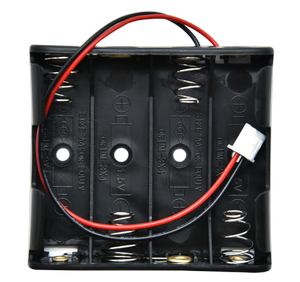

**Thank you for choosing keyestudio!**

**We will endeavor to provide you with better products and services!**

------

**About Keyestudio**

Keyestudio is the best-selling brand owned by KEYES Corporation. Our product contains Arduino development and expansion boards, sensors and modules, Raspberry Pi, micro:bit expansion boards as well as smart cars and learning kits, which can help customers at any level to learn about Arduino.

Notably, all of our products are in line with international quality standards and are greatly appreciated in a broad menu of different markets across the world.

Welcome to check out more contents from our official website:

[http://www.keyestudio.com](http://www.keyestudio.com)

------

**Obtain Information and After-sales Service**

1. If something is found missing or broken, or you have some difficulty learning the kit, please feel free to contact us. Welcome to send email to us: [service@keyestudio.com](http://m.138.gz.cn/webadmin/~CAmsnCrrNXhTAySKCerrIfWjjZuuWVfI/~/usr/mod_edituser.jsp?;uid=service@keyestudio.com;;clearCache=)

2. We will endeavor to update projects and products continuously from your sincere advice! Thanks!

------

**Warning**

1. This product contains tiny pin headers, so please keep out of reach of children under 7 to prevent from lacerations. 
2. This product also contains conductive parts(control board and electronic modules). Please operate according to the requirements of tutorials. Otherwise, improper operation may damage parts due to overheating. In this case, do not touch it and immediately disconnect the circuit power.

------

**Copyright**

The Keyestudio trademark and logo are the copyright of **KEYES DIY ROBOT co.,LTD**. All products under Keyestudio brand can’t be copied, sold or resold without authorization by anyone or any company.

If you are interested in our products, please contact to our sales representatives:

[fennie@keyestudio.com](http://m.138.gz.cn/webadmin/~CAmsnCrrNXhTAySKCerrIfWjjZuuWVfI/~/usr/mod_edituser.jsp?;uid=fennie@keyestudio.com;;clearCache=)

------

# STEM Programming DIY Mini Light Controlled Phonograph Kit

------

## Kit List

**Please check the list to ensure that all parts are intact. If you find missing ones, please contact our sales staff immediately.**

|  #   |                             PIC                              |          NAME           | QTY  |
| :--: | :----------------------------------------------------------: | :---------------------: | :--: |
|  1   |                                            |     Expansion board     |  1   |
|  2   |                                            |     Battery holder      |  1   |
|  3   |                                            |        Basswood         |  1   |
|  4   |                                            |  M3*10mm copper pillar  |  1   |
|  5   |                                            |  M3*8mm copper pillar   |  1   |
|  6   |        | M3*6mm flat head screw  |  3   |
|  7   |  | M4*8mm round head screw |  4   |
|  8   |  |         M4 nut          |  4   |
|  9   |                       |    3PIN DuPont wire     |  2   |
|  10  |                                           |      Photoresistor      |  1   |
|  11  |                                           |     Power amplifier     |  1   |
|  12  |                                           |       Screwdriver       |  1   |

------

## Introduction

With basswood as its structural material, we specially design a light control phonograph.

This kit integrates a photoresistor and 8002B power amplifier, which are compatible with micro:bit boards and ESP32 Easy Coding Boards. We write codes via Makecode and KidsBlock to play beautiful melody or even to achieve more creative and interesting functions.

With this kit, you can master basic sensor knowledge and have an excellent opportunity to learn programming. Except for the creation of enchanting music, it is also a perfect combination of learning and entertainment which stimulates your creativity and talent.

------

## Features

1. **Simple assembly:** For convenience, the assembly is easy and simple so that you may complete installations quickly.
2. **Experience of phonograph:** You can experience phonograph to play a variety of songs and enjoy the fun of music.
3. **Combination of programming and music:** It integrates music with programming, providing you with a novel and creative programming experience.
4. **Multiple programming:** Makecode and KidsBlock programming are available, which meet the diversified programming needs and expand the range of learning.

------

## Assembly

### step1

------

------

------

------

------

------

------

### step2

------

------

------

------

------

------

------

------

### step 3

Connect the module to the board via wire. Please do not reverse the wiring.

| Module | DuPont wire |
| :----: | :---------: |
|   S    |   Yellow    |
|   V    |     Red     |
|   G    |    Black    |

------

------

------

------

------

------

------

------

------

------

------

------

------

------

------

------

### step 4

**When wiring up, please note the colors of wires: S to yellow; V to red; G to black.**

**Microbit Wire up.**

| Expansion board | Photoresistor | 8002B amplifier |
| :-------------: | :-----------: | :-------------: |
|        S        |    P1/io14    |     P0/io12      |
|       3V3       |       V       |        V        |
|       GND       |       G       |        G        |

------

**ESP32 Wire up.**

| Expansion board | Photoresistor | 8002B amplifier |
| :-------------: | :-----------: | :-------------: |
|        S        |    P1/io14    |     P8/io4      |
|       3V3       |       V       |        V        |
|       GND       |       G       |        G        |

------

------

### step 5

------

------

------

------

------

------

------

------

### step6

------

------

------

------

------

------

------

------

------

### step7

------

------

------

------

------

------

------

------

------

------

------

### step8

------

------

------

Mount the six components in the same way.

------

------

------

Again, mount the six components in the same way.

------

### step9

------

Align the slots to combine them together.

------

------

------

------

------

------

------

------

Completed!

------

------

------

------

------

### step10

------

------

Completed!

------

------

### step11

Battery holder: put the batteries inside first **(four AAA batteries are required. Please do not reverse.**

------

| Expansion board | Battery holder |
| :-------------: | :------------: |
|        +        |      Red       |
|        -        |     Black      |

Connect the battery holder to the expansion board. Note the colors of the wires!

------

Open the front cover.

------

Put the battery holder inside it.

------

------

Close the cover board.

------

### Main Board

Microbit:

------

ESP32 Easy Coding Board:

------

## Resources

[https://www.keyestudio.com/](https://www.keyestudio.com/)

[https://wiki.keyestudio.com/Main_Page](https://wiki.keyestudio.com/Main_Page)

[Micro:bit Educational Foundation | micro:bit (microbit.org)](https://microbit.org/)

<https://tech.microbit.org/hardware/>

<https://microbit.org/new-microbit/>

<https://www.microbit.org/get-started/user-guide/overview/>

<https://microbit.org/get-started/user-guide/features-in-depth/>

[https://www.espressif.com/](https://www.espressif.com/)

------

## Tutorials

Download tutorials and codes: 

<https://fs.keyestudio.com/KS0803>

### 1. Basic Projects

Basic projects include development board introduction, programming methods, the ways of burning codes and the usage of sensors and modules. You will have a clear understanding on the board functions.

If you are a beginner, please firstly read the introduction and using methods of development board (Micro:bit /ESP32Easy Coding Board) to learn how to program on software and how to upload code.

[Basic Courses: Microbit](Microbit/Basic_Courses.md)

<!--[Basic Courses: ESP32 Easy Coding Board](ESP32/Basic_Courses.md)-->

### 2. Phonograph Projects

Do operations according to the tutorials of the two development boards.

#### 1. ESP32 Easy Coding Board Tutorial

[ESP32](ESP32/ESP32.md)

#### 2. Microbit Tutorial

[Micro:bit](Microbit/Microbit.md)

------

